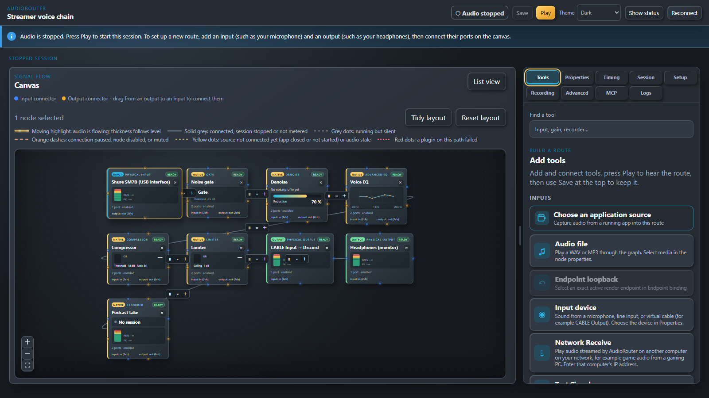
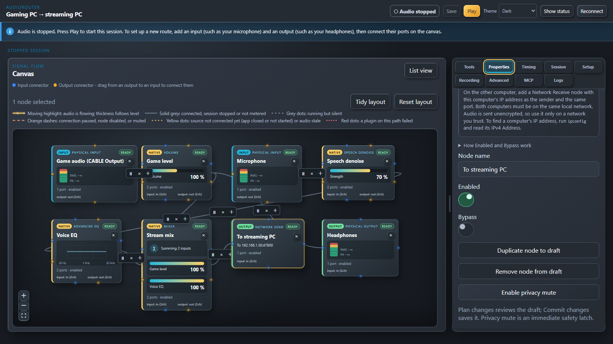
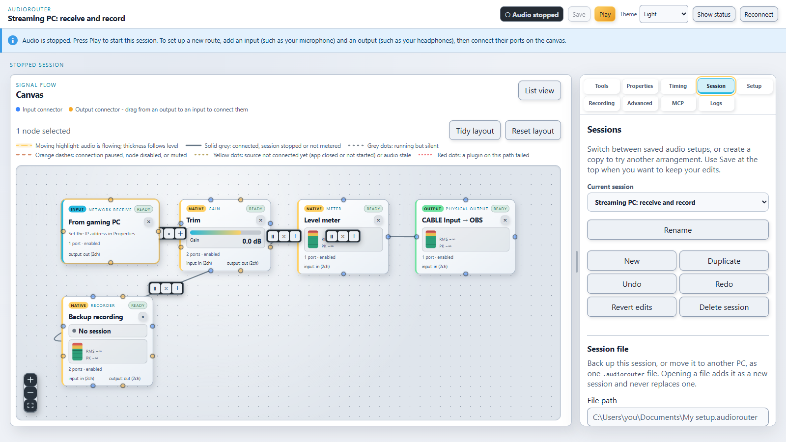
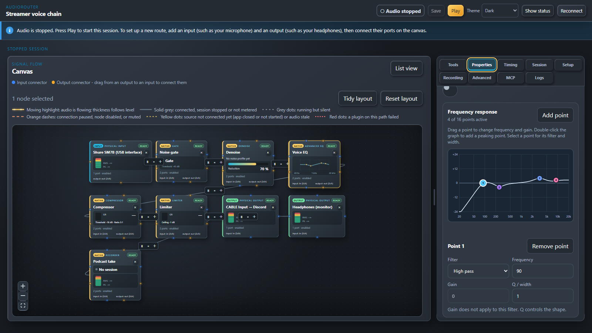

# AudioRouter

**See your sound. Shape it. Send it anywhere.**

AudioRouter is a visual audio router for Windows 11. Draw your audio on a
canvas: plug a microphone into a noise gate, an EQ and a compressor, send the
result to Discord, monitor it in your headphones and record it, all at once.
Stream game audio from your gaming PC to your streaming PC over your home
network. Every route is a picture you can read, and every setting is live.



## Install on Windows

**[Download AudioRouter 0.0.5 for Windows 11 x64](https://github.com/MrDesjardins/audiorouter/releases/tag/v0.0.5)**

1. Download the setup executable from the release assets.
2. Run `AudioRouter_0.0.5_x64-setup.exe` to install.
3. Open AudioRouter and allow audio device access when you first press Play.

This is an **unsigned preview**: Windows may show a security warning.
Clean-machine, upgrade and uninstall qualification remain open; see
[distribution status](docs/operations/distribution.md). A virtual cable such
as VB-Cable is needed only when routing into another app.

[Build from source](#install) · [First route](#your-first-route-in-one-minute) ·
[User guide](docs/operations/quickstart.md)

## Videos

| Video | Watch |
| --- | --- |
| AudioRouter overview (2 minutes) | [Watch on YouTube](https://youtu.be/IHitHqpi87s) |
| Your first route | [Watch on YouTube](https://youtu.be/3--AnDZZXzA) |
| Streaming audio between two PCs | Coming soon — video placeholder |

<!-- Replace the placeholders above with the user-provided video links. -->

## Why AudioRouter

- **One canvas instead of five control panels.** Sources on the left, outputs
  on the right, processing in between. The lines show where sound flows and
  pulse with its level while it plays.
- **Studio processing for your voice.** Noise gate, denoise, speech denoise,
  de-hum, de-click, a 16-point parametric EQ, graphic EQ, compressor,
  limiter, delay, pitch, bass/treble and more: 30+ built-in tools.
- **Your VST plugins, safely.** Load x64 VST2 effects (for example the
  free ReaPlugs) and qualified VST3 effects, and open a plugin's own editor
  while audio plays. Each plugin runs in an isolated worker process, so a
  crashing plugin cannot take your route down with it.
- **One source, many destinations.** Split a processed microphone to Discord,
  to OBS, to your headphones and to a recorder in a single route. Mix several
  sources into one with the Mixer and per-input levels.
- **Two-PC streaming built in.** Network Send and Network Receive carry audio
  between computers on your local network, with no extra software.
- **Capture one application.** Route just the game, just the browser or just
  Spotify instead of the whole desktop.
- **Record while you route.** Record any branch to a file, with a recording
  library.
- **Save it, back it up, move it.** Keep several sessions ("Streaming",
  "Podcast", "Late-night gaming") and switch between them. Save a whole
  session, including its imported audio and plugin settings, to one
  `.audiorouter` file and open it on another PC.
- **Built for glitch-free audio.** The audio path never waits on the screen,
  disk or network. Audio changes are qualified with a sine-wave continuity
  test that requires zero glitches.
- **Private by design.** No cloud, no account, no telemetry. AudioRouter never
  changes your Windows default devices or volumes. It never switches to
  another microphone behind your back, and a failed effect on your voice path
  goes silent rather than leaking unprocessed audio.
- **Scriptable.** Everything in the UI is also available from a command line
  and from an AI assistant through a local, permission-controlled MCP server.

## See it in action

**Two PCs, one stream.** The gaming PC mixes game audio with a cleaned-up
microphone and sends the mix to the streaming PC, while you keep the game in
your headphones.



**The streaming PC receives it**, trims the level, feeds OBS through a virtual
cable, and keeps a backup recording. The light theme is shown here; a
high-contrast theme is also available.



**Shape your voice precisely.** The Advanced EQ has up to 16 points you drag
on a live frequency-response curve, or type exactly: high/low pass, shelves,
peaking and notch filters.



## What you can build

| Goal | Route |
| --- | --- |
| Clean voice for Discord | Microphone → Noise gate → Denoise → EQ → Compressor → Output *CABLE Input*; pick *CABLE Output* as the microphone in Discord |
| Hear yourself while streaming | Split the same chain to your headphones |
| Podcast with a safety copy | Add a Recorder branch next to the live output |
| Game audio to a second PC | Gaming PC: Game → Network Send · Streaming PC: Network Receive → Output to OBS |
| Stream only the game | Application source (the game) → Volume → Output |
| Try an effect without risk | Toggle Bypass or Enabled on any node while it plays |

## Install

For a source build, follow the steps below. The ready-to-install preview is
linked under [Install on Windows](#install-on-windows).

### 1. Install the prerequisites

On a Windows 11 x64 PC, install:

| Tool | Where | Notes |
| --- | --- | --- |
| Visual Studio 2022 Build Tools | [visualstudio.microsoft.com](https://visualstudio.microsoft.com/downloads/) | Select **Desktop development with C++** (includes the MSVC compiler and Windows SDK) |
| Rust | [rustup.rs](https://rustup.rs) | Default stable toolchain, 1.80 or newer |
| Node.js | [nodejs.org](https://nodejs.org) | Version 22 LTS or newer |
| Git | [git-scm.com](https://git-scm.com) | |
| VB-Cable *(optional)* | [vb-audio.com/Cable](https://vb-audio.com/Cable/) | Needed only to send AudioRouter's sound into other apps such as Discord or OBS |

WebView2, which draws the interface, is already part of Windows 11.

### 2. Build AudioRouter

Open **PowerShell** and run:

```powershell
git clone https://github.com/MrDesjardins/audiorouter.git
cd audiorouter

# The interface
npm.cmd ci --prefix contracts
npm.cmd ci --prefix ui
npm.cmd run build --prefix ui

# The app, its plugin worker and its command line, in one folder
$env:CARGO_TARGET_DIR = "$PWD\target\app"
cargo build --release --manifest-path src-tauri/Cargo.toml --features custom-protocol
cargo build --release -p audiorouter-plugin-host --bin audiorouter-plugin-worker
cargo build --release -p audiorouter-cli
```

The first build takes several minutes. The three programs end up in
`target\app\release`.

### 3. Put it in place and allow it to use your audio devices

Still in the same PowerShell window:

```powershell
$app = "$env:LOCALAPPDATA\Programs\AudioRouter"
New-Item -ItemType Directory -Force $app | Out-Null
Copy-Item target\app\release\audiorouter-shell.exe, target\app\release\audiorouter-plugin-worker.exe, target\app\release\audiorouter-cli.exe $app

```

On first launch, AudioRouter enrolls your Windows account locally. On first
Play, it asks permission to use audio devices. Your sessions are stored in
`%LOCALAPPDATA%\AudioRouter`.

### 4. Start it

Double-click `audiorouter-shell.exe` in `%LOCALAPPDATA%\Programs\AudioRouter`
(right-click → *Send to* → *Desktop (create shortcut)* to keep it handy).
Run one copy of AudioRouter at a time.

To update later, run `git pull` in the `audiorouter` folder, repeat step 2,
then copy the three programs again (step 3's `Copy-Item` line) while
AudioRouter is closed.

## Your first route in one minute

1. In **Tools**, add an **Input device** and an **Output device**.
2. Select each one and choose the real device (your microphone, your
   headphones) in **Properties**.
3. Drag from the input's orange connector to the output's blue connector.
   Add a **Noise gate** or **Advanced EQ** in between if you like.
4. Press **Play**. Speak, watch the line light up, and tweak settings live.
5. Press **Save** to keep the route. **Session → Save to file…** backs it up.

**Setup** shows what AudioRouter sees on this PC. The
[quickstart](docs/operations/quickstart.md) covers plugins, recording,
application capture and networking in depth.

## Documentation

- [Quickstart and user guide](docs/operations/quickstart.md)
- [What is done and what is not](docs/plans/active/current.md#where-things-stand)
- [Plugin compatibility](docs/operations/plugin-compatibility.md)
- [API reference](docs/operations/api-reference.md) for the command line and MCP
- [Documentation index](docs/README.md), [product scope](docs/spec/01-product.md) and [reference workflows](docs/spec/02-workflows.md)

Known limits of the preview: no signed installer;
clock drift between two different devices is not corrected yet (rare,
regular clicks on very long sessions); and clean-machine qualification is
still open. The
[M08 release evidence](docs/plans/active/evidence/M08-release.md) records the
exact release boundaries. AudioRouter uses existing virtual devices such as
VB-Cable; it will not install its own audio driver.

## For contributors

The code is a Rust workspace (control plane, real-time engine, WASAPI audio,
plugin host, storage, transport, CLI) plus a React/TypeScript interface in a
Tauri desktop shell. Development agents must read [AGENTS.md](AGENTS.md) and
the [active plan](docs/plans/active/current.md). `AGENTS.md` is the canonical
agent instruction file; do not create a case-only `agent.md` duplicate on
Windows.

Only VST3 fixture and validator work needs the Steinberg VST3 SDK (building
the app does not). It is source-distributed; the pinned checkout lives under
the ignored `third_party/vst3sdk` directory:

```powershell
powershell -ExecutionPolicy Bypass -File .\tools\m06-vst3-sdk\install.ps1
```

See [SDK setup](docs/operations/sdk-setup.md) for the pinned revision and
verification commands. The README images are regenerated with
`AUDIOROUTER_README_SHOTS=1` and `npx playwright test e2e/readme-screenshots.pw.ts`
in `ui` (after `cargo build --example e2e_backend -p audiorouter-control`).
Setup does not install drivers, register plugins, or change audio devices or
other machine audio settings.
