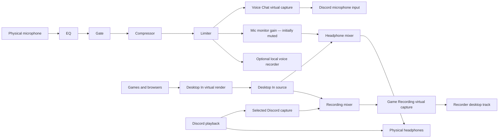

# 02 — Reference workflows and observable outcomes

Milestone ownership: M03 routes; M04 effects/recording; M05 guided setup; M07 automation; M08 end-to-end acceptance. Scenario IDs remain stable across implementations.

## UC-01: Gaming, voice chat, and separate recording

Use three named virtual buses: `Desktop In` (apps render here), `Voice Chat` (Discord captures here), and `Game Recording` (OBS or another recorder captures here). Names are editable labels; the API stores stable IDs. Headphones are a physical render endpoint. The microphone is a physical capture endpoint.

This figure includes external application selections as context, not editable in-process edges. The recording mixer combines desktop and optional Discord capture. The optional Discord capture branch records callers only when enabled; it is off in the default template. Discord's ordinary output plays directly to the headphones in this template and is not also routed through the headphone mixer. If Discord instead renders into `Desktop In`, omit its separate capture branch because it is already in desktop audio. UI and API shall explain this choice before starting.

Windows' default multimedia output may be changed by the user to `Desktop In`; Discord's output is selected explicitly as headphones. The setup assistant guides these selections and verifies observed activity. v1 must not depend on undocumented APIs to force a third-party application's choices. Missing applications can be configured later.

| Destination | Required contents | Forbidden contents |
| --- | --- | --- |
| Voice Chat / Discord input | Processed microphone | Desktop, game, browser, Discord return audio |
| Headphones | Desktop and Discord playback; optional mic sidetone | Duplicate desktop or duplicate Discord playback |
| Game Recording capture | Desktop; optionally Discord via explicit branch | Microphone unless user adds it |
| Optional local voice file | Processed microphone | Desktop and callers |

**Acceptance:** play distinct known signals into microphone, game, and Discord return. Capture each destination. Confirm expected routes and absence of forbidden signals under the isolation thresholds in [14](14-quality.md). Enable mic monitoring without changing Discord's signal. Bypass EQ without changing route topology. Remove the optional recorder while voice and desktop remain continuous. Close/reopen the UI and verify sessions keep running.

## UC-02: Processed microphone with branch-specific effects

Mic → shared EQ → split. Branch A → monitor gain → headphones. Branch B → gate → compressor → limiter → Voice Chat. Branch C → WAV recorder. A processor added after the split affects only its branch. One before the split affects every downstream branch.

**Acceptance:** change the branch B gate threshold while a low-level tone is present. Only the Discord feed changes; recorder and monitoring remain unchanged. Muting the monitor does not mute Discord. Disabling the microphone silences every downstream branch. Deliberately bypassing a gate passes audio according to the user's edit; a gate crash or plugin fault shall follow the protected-path silence policy instead.

## UC-03: Capture one application

Choose a running browser or game and capture its process tree into a recorder. Other applications remain excluded. The picker displays the selected executable identity and process-tree scope; it does not promise selecting a browser tab.

**Acceptance:** a second unrelated app plays a distinguishable signal and is absent from the recording. Restart the selected app: the binding transitions through unavailable and reconnects only to its verified identity. Multiple matching instances produce a visible selection requirement according to [05](05-windows-capture.md). Ordinary playback continues unless the user reroutes the app into a virtual render endpoint.

## UC-04: Mix-minus conversation

Mic + soundboard → explicit mixer → call input. Call return + soundboard + optional mic → separate monitor mixer → headphones. Mic and call return → recording mixer or separate recorders. Call return never goes to call input.

**Acceptance:** route inspection returns all contributing sources for each output and flags an attempted return-to-input route. A known external call-return relationship is represented as topology metadata. No general claim of acoustic echo cancellation is made. A physical speaker near the microphone can still create acoustic feedback; headphones are the template default.

## UC-05: App-to-app pass-through and reusable submix

A media app selects `Music In` as output. An AudioRouter virtual-source node reads it and feeds a mixer with a microphone. That mix feeds two distinct virtual capture endpoints. The same source can fan out without opening duplicate hardware streams.

**Acceptance:** both clients receive the mix at independent gains. Stopping one consumer does not stop the other. A virtual bus's render side has no hidden connection to its capture side: removing the explicit pass-through edge produces silence. Reusable submixes in v1 are named graph groups/presets; cross-session virtual nesting uses tracked endpoint edges and cycle validation.

## UC-06: Device failure and recovery

Unplug the USB microphone during a call, then reconnect it. Switch the Windows default output while a “follow default” output node is active. Suspend/resume the PC. Crash a plugin worker.

**Acceptance:** missing microphone produces silence, never a substituted input. Pinned headphones stay pinned; follow-default output resolves the configured role and checks feedback again. Status identifies the affected node and suggested action. Reconnect transitions are bounded and de-clicked. Plugin failure affects only dependent paths; the protected voice path is silenced. Recordings retain all completed data and mark gaps.

## UC-07: External assistant edits while the UI is open

An assistant discovers devices/node schemas, reads revision N, proposes adding a notch filter before Voice Chat, previews affected routes, and commits. Meanwhile the person changes monitor gain.

**Acceptance:** an outdated base revision returns a conflict; it does not overwrite the person's edit. The assistant re-reads and replans. On commit, UI state and backend revision agree. The assistant can explain what reaches Discord using backend route introspection, without reading canvas coordinates or audio content. Undo uses a new revision and cannot silently discard another client's changes.

## UC-08: Recording without disrupting a live call

Record separate mic and desktop WAV files with a common session start, plus an optional mixed FLAC file. Pause/split/stop a recorder independently. Fill its destination disk or revoke access.

**Acceptance:** call audio remains continuous. Recorder status distinguishes recording, paused, stopping, completed, and failed. Split files preserve timeline metadata. Disk errors stop only affected recording work and identify partial/recoverable files. A recorder that is not explicitly armed never starts because a session was merely opened or imported.

## UC-09: Persistent endpoints and reboot

Save and run the reference setup, opt into start-at-sign-in, reboot, and sign in. Open Discord before the editor.

**Acceptance:** virtual endpoints retain identities; capture is silent until the approved session is running. The editor need not be opened. Opening it shows the actual current state. Without startup opt-in the saved session remains stopped. No audio resumes under another Windows user's account.

## UC-10: Entirely headless setup

Using only CLI and a separately authorized driver installer, enumerate devices, create the buses, create and validate the graph, start it, change gain, inspect meters, record a file, export, stop, and restore from export with device rebinding.

**Acceptance:** all operations have structured results and meaningful exit codes. UI and MCP clients show the same configuration and failures. External app selection may still require that app's own UI; document this boundary in command output instead of claiming AudioRouter controls Discord internally.
