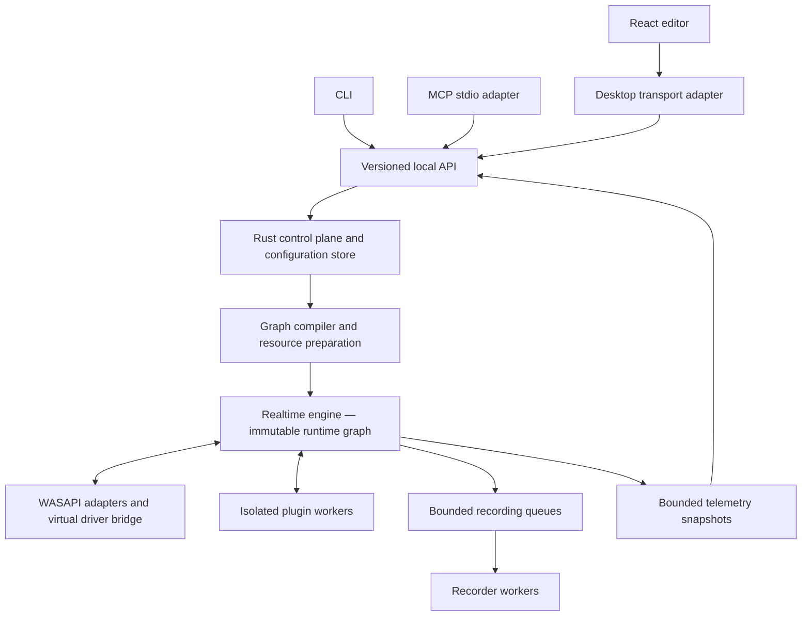

# 03 — Architecture and implementation boundaries

Milestone ownership: M00 validates Windows/driver choices; M01 contracts/control plane; M02 realtime engine. Later milestones must preserve these boundaries.

## Chosen baseline

Rust is the primary backend language, targeting the Windows MSVC toolchain. Use a narrowly contained Windows API adapter (candidate: `windows` bindings) around WASAPI, MMDevice, process discovery, and native lifecycle. React + TypeScript + Vite is required for the interface. The proposed desktop shell is Tauri 2/WebView2; its Rust code forwards to the external backend and owns window/tray integration only. React Flow is a candidate canvas library, not the graph authority. Pin exact supported dependency versions during M00/M01 and record licenses; do not infer compatibility from this document.

The virtual driver will likely require WDK/C++ and specialist testing. Permit small C++ bridges for driver/SDK boundaries while retaining Rust ownership of routing and business logic. Do not force experimental kernel Rust into the release path. M00 must decide whether to license an existing redistributable driver or maintain a project driver. See [06](06-virtual-devices.md).

## Requirements

- **ARCH-01 — One authority.** A single backend process per interactive Windows user owns the configuration database and running graph. UI/CLI/MCP cannot edit persistence files or invoke audio adapters directly. An OS-restricted singleton prevents competing instances. Background process lifetime is independent of the editor.
- **ARCH-02 — Process split.** Run the backend as a user process, optionally launched at sign-in; do not put user-session audio in a LocalSystem service. Isolate plugin discovery/execution and file encoders from realtime scheduling. A privileged installer/broker may manage the driver through a small allowlisted interface and may not accept arbitrary commands or paths to load.
- **ARCH-03 — Shared command path.** All clients serialize the same application API requests. Presentation validation can improve feedback but backend validation remains mandatory. Generated contracts/schema fixtures shall prevent adapter drift. The shell has no private “fast path” for audio changes.
- **ARCH-04 — Realtime safety.** The processing path shall use preallocated bounded buffers, bounded lock-free or equivalent nonblocking queues, and precompiled graph schedules. No disk/network I/O, heap allocation/deallocation, blocking mutex, synchronous IPC, unbounded retry, UI callback, or formatting/logging occurs on the audio thread. Deferred reclamation shall free old graphs outside the callback.
- **ARCH-05 — Windows scheduling.** Use event-driven shared-mode WASAPI by default. Query supported periods and formats; record negotiated values. Register appropriate audio scheduling through supported Windows facilities after testing. Rust async executors handle control work, not realtime deadlines. Document COM apartment and callback lifetime rules explicitly.
- **ARCH-06 — Runtime compilation.** Validate graph structure, formats, channel maps, resource ownership, feedback, memory budget, and latency before activation. Prepare devices and workers off-thread. Publish a complete runtime generation at a block boundary. Failed preparation keeps the previous committed graph intact.
- **ARCH-07 — Internal representation.** v1 uses 48 kHz planar float32 graph audio, mono/stereo ports, and an initial 128-frame processing quantum. Adapters may accumulate/split device periods without claiming they are also 128 frames. M00 measurements may revise the quantum via a documented decision. Convert sample formats and rates only at explicit boundaries; expose conversions in diagnostics.
- **ARCH-08 — Clock domains.** Choose one session timeline/master clock, resample asynchronous sources/sinks, and bound FIFO occupancy. Never assume two USB devices share a clock. Report drift corrections, discontinuities, and effective latency. Output fan-out cannot allow a slow device to stall the graph.
- **ARCH-09 — Isolation.** One failing recorder/plugin/device shall not block unrelated branches. Queue overflow/underrun has a defined policy, counter, and event. Failure propagation follows graph dependencies and protected-path policy. An audio worker returning NaN/Inf must be sanitized and faulted without leaking invalid samples to outputs.
- **ARCH-10 — Headless testability.** Separate domain logic and graph compilation from Windows interop. Provide deterministic fake devices, clocks, plugins, and storage for API and fault testing. Keep Windows integration tests distinct and mandatory at applicable milestones.
- **ARCH-11 — Resource ownership.** Prefer one shared capture stream per physical endpoint and compatible capture mode across sessions, with internal fan-out. A single backend endpoint manager arbitrates physical output mixing. Exclusive virtual capture writers are enforced globally. Resource allocation and release must be idempotent under disconnect/crash/retry.
- **ARCH-12 — Dependency discipline.** Freeze a supported Rust toolchain, Node LTS, package lockfiles, SDK/WDK, WebView2 requirements, and plugin SDK revision. Keep third-party notices and a dependency inventory. Every major substitution requires a decision with criteria, compatibility tests, migration impact, and rollback.

## Suggested repository layout when implementation begins

`crates/domain`, `crates/contracts`, `crates/control`, `crates/engine`, `crates/windows-audio`, `crates/cli`, `crates/mcp`, `apps/desktop`, `workers/plugin-host`, `driver`, `schemas`, `tests/fixtures`, and `docs` express intended boundaries. Create only the components required for the current milestone. Avoid empty scaffolding for future features.

## Ownership of transient state

Backend: selected session, node configuration, running state, recorder status, device availability, binding resolution, permission grants, revisions, and operation status. UI: viewport, hover, drag preview, open panels, and unsent editor drafts. Layout coordinates may be saved as separate presentation metadata; they never determine audio connectivity. Backend telemetry is coalesced into UI updates, not rendered at audio rate.

## Failure/restart model

Driver endpoints exist independently of backend liveness and produce silence on missing/stale data. Restart restores a durable committed revision; recorder recovery follows [08](08-recording.md). The backend must identify whether an operation committed before a disconnection so retries cannot create duplicate nodes or recording files. “Editor closed,” “backend stopped,” and “driver missing” are separate states.

Background operation begins after sign-in, not at boot in an arbitrary user context. Multiple logged-in users require exclusive ownership of a virtual bus data bridge; an unowned bus produces silence. v1 does not mix microphone data between accounts.
